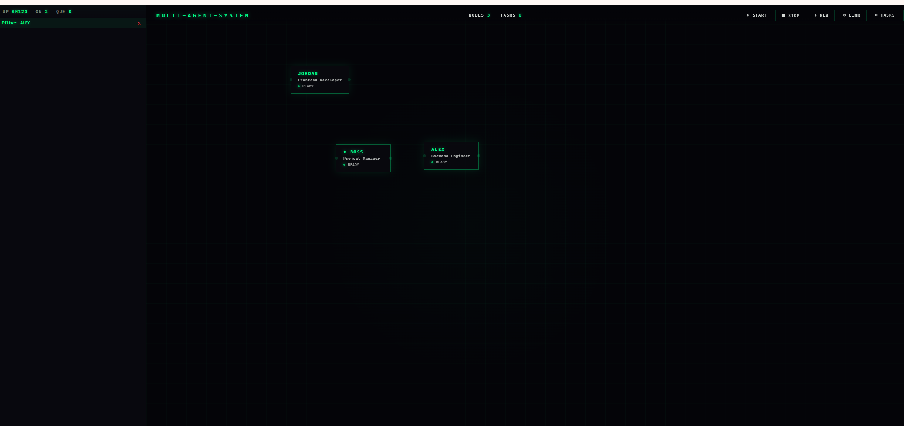

# Multi-Agent-System — Local Multi-AI Agent Orchestration

> 20 AI agents (Claude / Gemini / Kimi) collaborate autonomously.
> PM agent decomposes goals into subtasks, assigns to specialists,
> each with their own tools, workspace, and memory.
> Zero extra API cost — uses your existing CLI subscriptions.



## What It Does

| You say | What happens |
|---------|-------------|
| "Build a todo app" | Boss splits → Alex writes Flask API → Jordan writes HTML/JS frontend |
| "Write a blog about AI" | Boss splits → Copy writes draft → Review edits |
| "Explain REST vs GraphQL" | Boss answers directly (single-agent mode for simple tasks) |

Each agent independently calls LLM APIs, uses tools (`write_file`, `run_command`, `search_web`...), and writes output to its own sandboxed workspace.

## Architecture

```
User → Boss (PM Agent)
       ├→ Alex   (Backend)  → write_file, run_command → _workspaces/alex/
       ├→ Jordan (Frontend) → write_file, run_command → _workspaces/jordan/
       ├→ Luna   (UI)       → write_file              → _workspaces/luna/
       ├→ DB     (Database) → run_command              → _workspaces/db/
       └→ Sage   (QA)       → read_file, run_command   → _workspaces/sage/
```

### Internal Architecture

```
localhost:3000 — Main Server (FastAPI)
├── Dispatcher     — flowMap DAG routing
├── Agent Runner   — LLM call + tool loop (max 10 rounds)
├── Task Queue     — per-agent asyncio.Queue
├── Watcher        — 15s nudge → 45s timeout → force complete
├── Tool System    — 10 tools (file / shell / web / git / mark_complete)
├── Memory         — conversation persistence per agent
├── Reflection     — output quality scoring + auto-retry
├── DNA System     — auto-generate / evolve / retire agent profiles
└── SysLog         — structured JSONL + WebSocket live push

localhost:4000 — LLM Proxy (OpenAI-compatible)
├── Kimi    — auto-detects local CLI credentials
├── Claude  — CLI subprocess bridge (uses your subscription)
├── Gemini  — auto-detects local CLI credentials
└── OpenAI / OpenRouter — standard API key
```

## Quick Start

```bash
git clone https://github.com/q15432123/multi-agent-system.git
cd multi-agent-system
pip install -r requirements.txt
python run.py
# Open http://localhost:3000
```

First-time setup wizard guides you through LLM provider configuration.

## LLM Provider Options

| Method | Cost | Providers | How |
|--------|------|-----------|-----|
| CLI subscription (recommended) | Free* | Kimi, Claude, Gemini | `kimi login` / `claude login` / `gemini login` |
| API key | Pay per use | OpenRouter, OpenAI, Google AI | Paste key in setup wizard |

\* Uses your existing paid subscriptions via locally installed CLI tools. All credentials stay on your machine.

## How Agents Work

1. **Boss (PM)** receives your task, decides complexity
2. **Simple task** → Boss answers directly
3. **Complex task** → Boss delegates via `@alex: build the API` `@jordan: build the frontend`
4. **Each agent** calls LLM → uses tools (write files, run commands) → outputs to `_workspaces/{agent}/`
5. **Watcher** monitors progress: nudges stalled agents at 15s, times out at 45s
6. **Results** relay downstream through flowMap connections

## Tool System

| Tool | Description |
|------|-------------|
| `write_file` | Write to agent's sandboxed workspace |
| `read_file` | Read files within workspace |
| `run_command` | Shell execution (non-interactive, 60s timeout) |
| `search_web` | Web search (DuckDuckGo) |
| `call_api` | HTTP requests to external APIs |
| `git_status` / `git_commit` / `git_diff` | Version control |
| `create_agent` | PM can dynamically create specialized agents |
| `mark_complete` | Signal task completion |

## Code Stats

- 32 Python files, ~6,000 lines
- 20 agent definitions (3 active by default, 17 available in `_team/_disabled/`)
- 10 registered tools
- 5 pip dependencies
- Single-file cyberpunk UI (no framework)

## Tech Stack

- Python 3.10+ / FastAPI / uvicorn
- OpenAI SDK (unified LLM interface)
- httpx (async proxy + format translation)
- Pure HTML/CSS/JS frontend with xterm.js

## Project Structure

```
multi-agent-system/
├── run.py              # Entry point (proxy:4000 + server:3000)
├── ui.html             # Web UI (flow graph, floating panels)
├── setup.html          # First-time setup wizard
├── engine/             # Core engine (32 files)
│   ├── server.py       # FastAPI routes + WebSocket
│   ├── llm_proxy.py    # LLM gateway (credential detection + format translation)
│   ├── agent_runner.py # Agent execution + tool loop
│   ├── dispatcher.py   # flowMap routing
│   ├── watcher.py      # Timeout monitoring
│   ├── tools/          # Tool system (10 tools)
│   ├── memory/         # Agent memory (episodic + knowledge graph)
│   └── dna/            # Agent DNA evolution
├── _team/              # Agent definitions (.md)
├── _pm/                # PM system prompt
├── _config/            # Runtime config (gitignored)
├── _workspaces/        # Agent output sandboxes (gitignored)
├── _mock/              # Mock test scripts
├── docs/               # Architecture whitepaper
└── examples/           # Usage examples
```

## Known Limitations

- **Experimental** — proof of concept, not production-ready
- **Single machine** — no distributed execution
- **CLI credentials may expire** — auto-refresh when possible, re-login if needed
- **Completion depends on LLM behavior** — 4-level fallback + watchdog timeout
- **Keyword search only** — no vector embeddings for memory yet

## Documentation

- [Architecture Whitepaper](docs/ARCHITECTURE.md) — full technical deep-dive
- [Example: Todo App](examples/demo_todo_app.md) — end-to-end demo

## License

MIT
